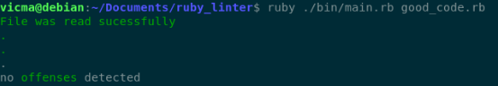

# RUBY LINTER

>  A custom linter for ruby files! is a Ruby code style checker, Apart from reporting problems in your code. In this project, we passed an argument(file path) from the command line to our executable for example
"ruby ./bin/main.rb bad_code.rb" file and go through the file line by line to detect some predetermined ruby offenses.

## RUNNING APP

   **GOOD CODE**

   **BAD CODE**

   **EMPTY FILE**

   **WRONG EXTENSION**

## NECESSARY REQUIREMENTS

- gem install colorize
- gem install bundler

## GETTING STARTED

- open your terminal
- clone the repository `$ git clone https://github.com/vicmaburrito/ruby_linter.git`
- cd ruby_linter
- code . in the terminal
- open the downloaded repository with vscode. 
- Run the command `$ ruby ./bin/main.rb ./folder/your_file.rb`

## BUILT WITH

- Ruby

## TESTING

- clone the repository `$ git clone https://github.com/vicmaburrito/ruby_linter.git`
- at the root level of the project run the command `rspec`
- see test results in the terminal

## AUTHOR

👤 **Manuel Aldaraca**

- GitHub: [@vicmaburrito](https://github.com/vicmaburrito)
- Twitter: [@ManuelAldaraca](https://twitter.com/ManuelAldaraca)
- LinkedIn: [LinkedIn](https://www.linkedin.com/in/manuel-aldaraca/)

## SHOW YOUR SUPPORT
Give a \* if you like the project

## 🤝 CONTRIBUTING
- Contributions, issues, and feature requests are welcome!
Feel free to check the issues page. Show your support
Give a ⭐️ if you like this project!

## ACKNOWLEDGMENTS

- Ruby Capstone Project by Microverse.

## 📝 License MIT
- This project is [MIT](./LICENSE) licensed.